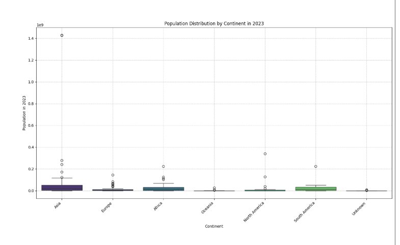

# world-population
Analysis of global population trends (2015–2023) with visualizations showing country distributions, European growth, and comparisons of China, India, Indonesia, Nigeria, and the US, highlighting demographic shifts and growth patterns worldwide.
## World Population Analysis

### Population Distribution (2023)

### Population Trends (2015–2023)

### Population Growth in Europe

### Population Comparison: Selected Countries

## World Population Analysis

### Population Distribution (2023)

### Population Growth in Europe

### Population Comparison: Selected Countries

